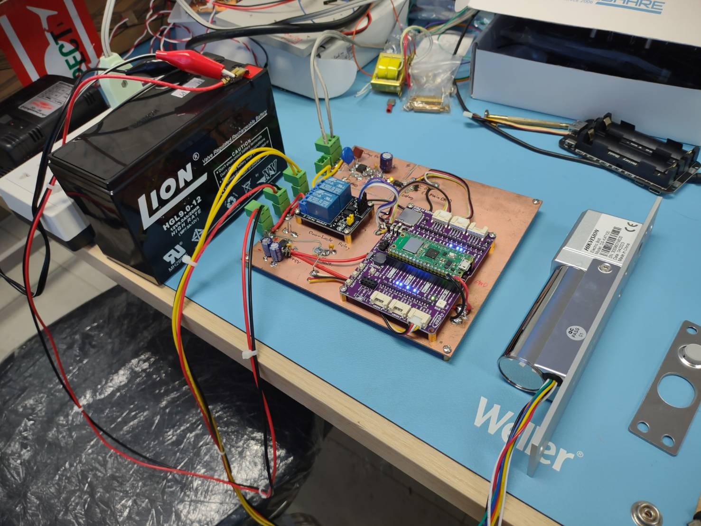

# FailSecureDoor_RP2 version 1 (2023)
Firmware for Fail-secure door controller of access control room. It activates when power outage is occured. <br>
This is the rapid prototype project, PCB is constructed in a prototype way and Micropython are being used to develop the firmware. <br>
The access control unit is from ZkTeco brand. `pyzk` project is used for the python module to interface with ZkTeco AC. <br>
The project can be found in here https://github.com/fananimi/pyzk

### Fail-Secure Door Controller with Pico W (RP2040)


The firmware is written in micropython, stored in folder `rp2`. `ampy` can be used to upload the codes to MCU.
To upload firmware.
1. Upload micropython firmware .uf2 of Pico W. The latest firmware can be founded in here
    https://micropython.org/download/RPI_PICO_W/
2. `cd` to the repo
```
cd access_control_rpzk
cd rp2
```
3. Run `ampy put` to put the network configuration .json file into MCU
```
ampy -p /dev/ttyACM0 network_config.json
```
4. Run `ampy put` to put the codes into MCU
```
ampy -p /dev/ttyACM0 put umqtt 
ampy -p /dev/ttyACM0 put main.py main.py q_scheduler.py secure_doorlock.py
```
5. Verify the upload files by `ampy ls` or `ampy get`
```
ampy -p /dev/ttyACM0 ls
```
6. Reset MCU and run it.


### Worker for ZKTeco's Access Control & FailSecure Door
To deploy using Docker
1. `cd` to the repo
```
cd access_control_rpzk
```
2. Build worker image
```
sudo docker build -t acworker-image .
```
3. Run container from built image
```
sudo docker run -d --network=host --name=acworker acworker-image
```
