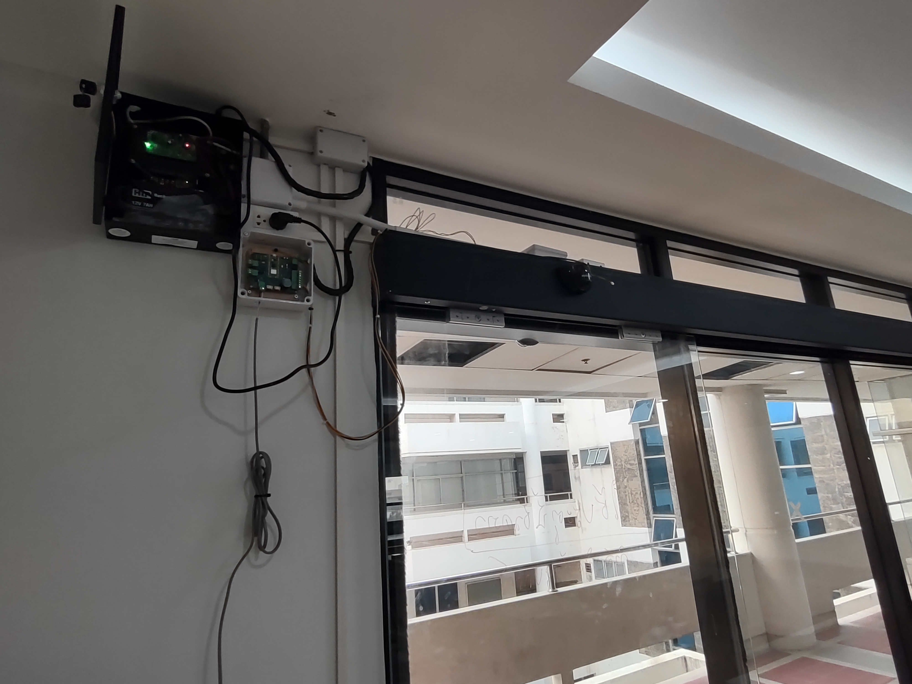

# FailSecureDoor_RP2 version 2 (2024)
The room consists of slider automatic door which needs the fail-secure bolt-lock system when outage occured. <br>
KiCAD is used for the controller board design (in `kicad`) and RPi Pico C SDK framework is used for the firmware development (in `firmware`). <br>
By the dafault, each door has the access control device `DS-K1T105AM` installed alongside. <br>
Our access control software will used the Software Worker (in `worker`) to interface with `DS-K1T105AM` via `ISAPI` and fail-secure board via MQTT. <br>
<br>
### Hardware Diagram
 <br>
### Network Diagram
 <br>

### HW Installation
 <br>
 <br>
 <br>

### Worker
To build the image <br>
```
cd worker
docker build -t acworker2024-image .
```
<br>
To run the worker as container <br>
```
docker run --network host -d --restart always --name acworker acworker2024-image
```

